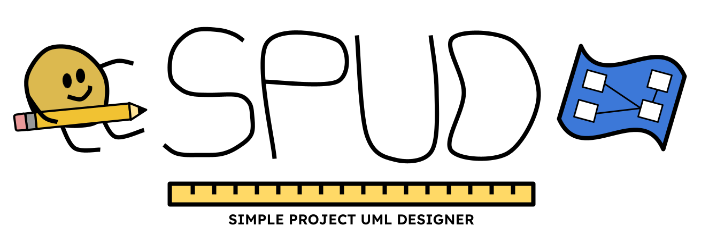

# What is SPUD?

---
SPUD (Simple Project UML Designer) is an open-source Qt C++ application that allows you to design and export UML designs. 

SPUD is under active development and currently does not have an available release.